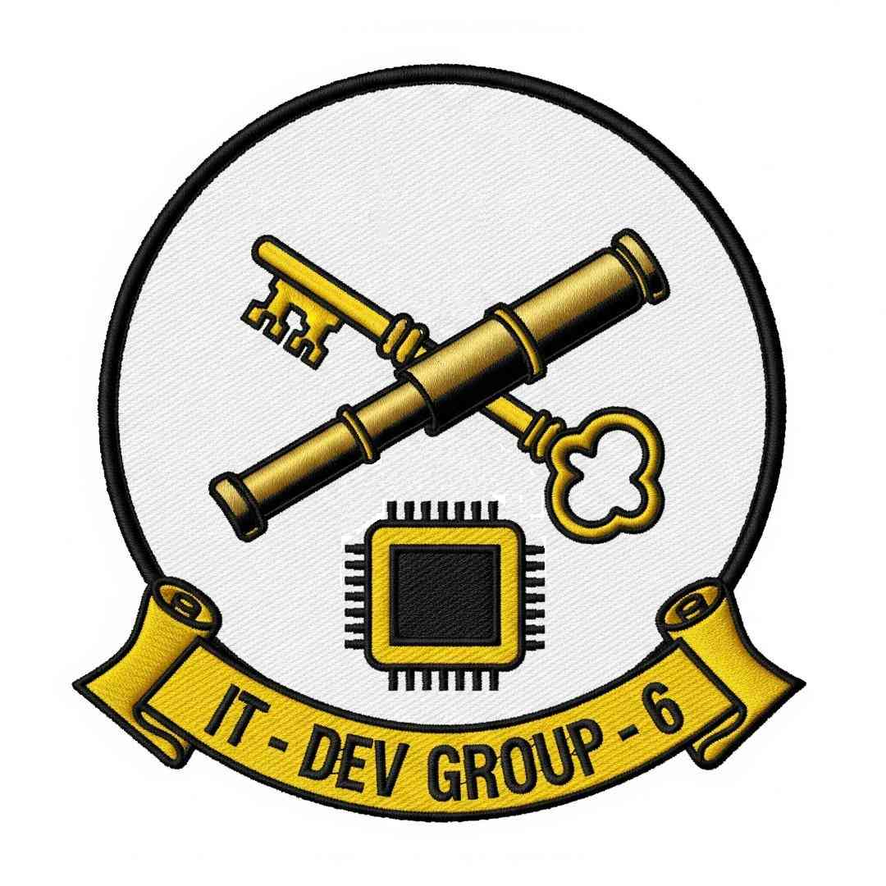

# Goon Drop Point



Shared drop point for DCS World `.miz` mission files used by IT-Dev-Group-6.

---

## How to upload a mission file

You don't need to know git. Everything below is done through the GitHub website.

### Step 1 — Create a GitHub account

If you don't have one, go to [github.com](https://github.com) and sign up. It's free.

### Step 2 — Fork this repo

A **fork** is your own personal copy of the repo where you can make changes.

1. Make sure you're logged in to GitHub
2. Go to the top of this page and click the **Fork** button (top-right corner)
3. On the next screen, click **Create fork**

You now have a copy of the repo under your own account.

### Step 3 — Upload your .miz file

1. In your fork, click into the **`uploads`** folder
2. Click **Add file → Upload files**
3. Drag your `.miz` file into the box (or click *choose your files*)
4. Scroll down and click **Commit changes**

### Step 4 — Open a Pull Request

A **pull request** (PR) is how you ask for your file to be added to the main repo.

1. After committing, GitHub will show a yellow banner saying your branch is ahead — click **Contribute → Open pull request**
   - If you don't see the banner, click the **Pull requests** tab, then **New pull request**
2. Give it a title like `upload: My Mission Name`
3. Click **Create pull request**

### Step 5 — Wait for the check to pass

Once you open the PR, an automated benchmark runs on your mission file. This checks for common performance issues.

- A green checkmark ✅ means the file passed — someone will review and merge it
- A red X ❌ means something needs attention — check the comment on the PR for details

### Step 6 — Done

Once merged, your file will appear on the [mission index page](https://it-dev-group-6.github.io/goon-drop-point/) and be available for the group to download.

---

## Notes

- Drop files in `uploads/` — they'll be moved to the right folder after review
- Don't rename `.miz` files after sharing them — scripts may reference filenames directly
- `.miz` files are ZIP archives containing Lua — open with any ZIP tool or the DCS Mission Editor

---

## Queue a runtime benchmark

Open a new issue using the **Benchmark mission file** template. The issue must have the `benchmark` label and list one or more `.miz` paths or direct download URLs.

Example:

```md
## Mission file(s)

- `uploads/MyMission.miz`
- `Dropshot/Vietguam3D6.2.0.miz`
```

When the issue is opened, edited, or labeled with `benchmark`, GitHub Actions will upload each listed mission to the benchmark queue.

New `.miz` files merged into `main` also create a `benchmark` issue automatically and queue the new mission file(s).

Repository setup required:

- Secret `DCS_BENCH_API_KEY`: orchestrator API key used to create queue items
- Variable `BENCH_HOST_ID`: defaults to `host_1ad3930ed744`
- Variable `BENCH_INSTANCE_ID`: defaults to `DCS-TexasBBQ`
- Variable `BENCH_DURATION_S`: defaults to `1800` seconds / 30 minutes
